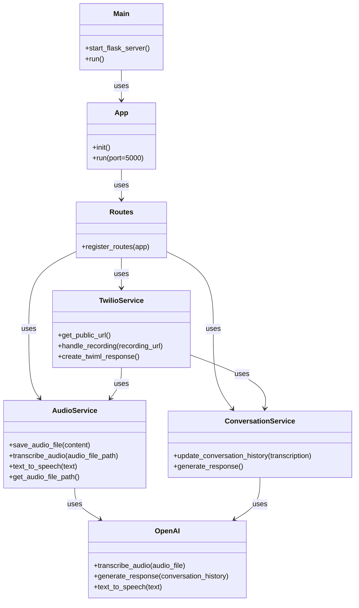

# クラス図

```mermaid
classDiagram
class App {
+init()
+run(port=5000)
}
class Main {
+start_flask_server()
+run()
}
class Routes {
+register_routes(app)
}
class TwilioService {
+get_public_url()
+handle_recording(recording_url)
+create_twiml_response()
}
class AudioService {
+save_audio_file(content)
+transcribe_audio(audio_file_path)
+text_to_speech(text)
+get_audio_file_path()
}
class ConversationService {
+update_conversation_history(transcription)
+generate_response()
}
class OpenAI {
+transcribe_audio(audio_file)
+generate_response(conversation_history)
+text_to_speech(text)
}
App --> Routes : uses
Main --> App : uses
Routes --> TwilioService : uses
Routes --> AudioService : uses
Routes --> ConversationService : uses
TwilioService --> AudioService : uses
TwilioService --> ConversationService : uses
AudioService --> OpenAI : uses
ConversationService --> OpenAI : uses
```